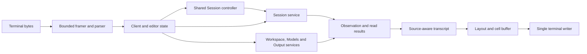

# Terminal application debugging reference

Use this reference to locate a TUI failure and choose evidence that distinguishes
execution, transport, projection, and terminal problems. The
[development tutorial](tui-development.md) provides an isolated launch setup.
Public behavior and bounds remain in the
[Terminal application contract](../crates/rsi/README.md#terminal-application),
[Session contract](../crates/rsi/session/README.md), and
[Host contract](../crates/rsi/service-host/README.md).

## Trace one operation

The launcher starts the selected ordinary Profile in
[`application.rs`](../crates/rsi/core/src/application.rs).
[`plugin.rs`](../crates/rsi/terminal/src/plugin.rs) prepares the terminal application
and owns its entry and cleanup. [`tui/mod.rs`](../crates/rsi/terminal/src/tui/mod.rs)
owns the client loop and asynchronous work. A useful debugging path is:



For a key-handling problem, stop in `Framer::advance` in
[`input.rs`](../crates/rsi/terminal/src/tui/input.rs), then follow the
parsed event into `run_inner`. `Client::submit` delegates to the shared Session
controller; `cancel` issues exact domain cancellations. `Client::action` routes
Workspace, Models and Output work to their independently injected services. `Submission.request` retains the immutable request during
reconciliation. Compare its MessageId and options across attempts before
investigating duplicate execution.

For an asynchronous result, inspect `Work.generation`, `Work.view_revision`,
and `Work.kind` alongside the current Client values. A prior attachment's work
must not alter the new Session; an old menu read must not reopen a dismissed
view. [`surfaces.rs`](../crates/rsi/terminal/src/surfaces.rs) composes each
attachment's renderer sink and shared
[`SessionController`](../crates/rsi/client/src/controller.rs) in a Shell-owned
child Profile. Check `CliRenderMessage::Observed.generation` as well: queued
events from a prior attachment must be discarded even when its SessionId matches.
Check the observation cursor and observer termination separately from a
successful one-shot `inspect` call.

For missing or misselected text, follow `Transcript::apply`, `add`, and
`selected` in
[`transcript.rs`](../crates/rsi/terminal/src/tui/transcript.rs).
Compare source `(seq, field, offset)` identities before and after history
insertion. A source byte offset is not a screen column. Investigate layout
only after the retained text and source mapping are correct.

`render::draw` computes rows and hit regions together in
[`render.rs`](../crates/rsi/terminal/src/tui/render.rs). Inspect
`State.top`, `selection`, and the returned `View` when scrolling or selecting.
On resize, compare the OS terminal size, TestBackend size, frame area, and ANSI
cursor positions. `render::resize` updates the backend as well as Terminal's
buffers because drawing queries the backend size again.

Finally, inspect `terminal::frame` and the writer in
[`terminal.rs`](../crates/rsi/terminal/src/tui/terminal.rs). Frames are
complete replacements and may be coalesced; setup and clipboard commands use
separate delivery paths. A correct TestBackend buffer does not prove that the
terminal received the frame or restored its modes.

## Collect diagnostics without corrupting the screen

The binary currently does not install a tracing subscriber. Setting RUST_LOG
alone does not enable an application log. Use a debugger, focused test
diagnostics, or explicit temporary file instrumentation. Keep temporary logs
out of the terminal writer's stdout and stderr while the alternate screen is
active. Restore terminal modes before displaying ordinary error diagnostics.

With the tutorial's isolated setup, capture ordinary errors separately:

```bash
tui_rsi --profile dev-tui --cwd "$tui_dev/workspace" --resume tui-dev \
  2> "$tui_dev/client.stderr"
```

Daemon diagnostics go through
[`host_cli.rs`](../crates/rsi/core/src/host_cli.rs). A detached daemon redirects
stdout/stderr to its owner log, whose location is derived by
[`ServiceHostPaths::owner_log`](../crates/rsi/service-host/src/owner.rs).
`host serve --profile dev` keeps foreground diagnostics visible; run it in a
separate terminal with the same isolated environment. Do not mix daemon
diagnostics with an active fullscreen client's terminal output.

For a debugger that supports separate inferior I/O, dedicate a second PTY to
the client and leave debugger commands on the debugger terminal. Stopping the
writer or signal handler while it owns raw mode can leave the inferior PTY
temporarily unusable. Resume or terminate that inferior before repairing its
terminal settings. For a dead client, `stty sane` in the affected terminal can
restore input settings; `reset` can repair remaining display state.

Record terminal size, TERM, NO_COLOR presence, multiplexer use, and raw input
bytes when reporting an input/rendering defect. Raw terminal captures can
contain task text and tool output; review them before sharing.

## Compare durable and displayed evidence

Start with the line profile's JSONL history and the TUI's live inspection.
Fullscreen `--output`, `--list`, and `--history` switches are intentionally
unavailable. Historical Fact pages and current interaction snapshots answer
different questions: an old question or approval in history is not a live
request that can still be answered.

Use these distinctions while investigating a failed coding task:

- A message receipt establishes mailbox acceptance. Find the subsequent
  MessageTurnAccepted and TurnTerminal Facts to establish execution and outcome.
- A ToolResult with `is_error=false` can still carry a nonzero command exit code
  or a signal. Check its value and the following model response before calling
  it a successful command.
- Completed process output is read through the issued stdout/stderr cache id.
  A truncated arbitrary Fact requires an exact source-window read instead.
- An old history page can stop because of byte bounds. Compare its cursor and
  continuation flag; a short page alone does not establish the beginning of
  history. UI-retained memory bounds also do not measure transient Fact decoding
  or total process RSS.

If raw Store inspection is necessary, open the fixture database read-only.
The SQLite implementation stores flattened Fact JSON, while application JSONL
wraps Facts in CLI event envelopes. Inspect the relevant format rather than
assuming every record has a nested `body` object. Schema and validation belong
to the [SQLite Store](../crates/rsi-agent/store-sqlite/README.md); avoid editing
durable records to make a reproduction pass.

## Investigate common failures

| Symptom | Next evidence to collect |
| --- | --- |
| Startup requires terminal stdin/stdout | Remove shell pipes or run through a PTY. Check `terminal::check` before debugging Host bootstrap. |
| A rebuilt client cannot attach | Run `host status` under the same paths. Stop the isolated old owner and relaunch it with the copied binary and matching Host Profile. Removing an owner lock is not a substitute for stopping its process. |
| A daemon exits before readiness | Read its owner log. If the Unix socket path exceeds 107 bytes, shorten XDG_RUNTIME_DIR; the derived path also contains a state-root digest and socket filename. Keep the tool helper executable outside the sandbox's private `/tmp`. |
| The model picker is empty | Check configured Language models and committed registration gates in the [AI router](../crates/rsi-ai/core/src/lib.rs). Compare deployment/model spelling with Settings. Enumeration does not query the provider. |
| A retry appears to submit different content | Compare the frozen `Submission.request` with the editor draft and submitted MessageId. A changed editor is not a changed accepted request. |
| The editor stalls behind a slow request | Inspect outstanding Work kinds, queue admission, and Submit/Cancel flags. Reproduce with pending futures in the [controller tests](../crates/rsi/terminal/src/tui/tests.rs). |
| Ctrl+C copies text or drops a draft | Trace raw key handling before menu/selection dispatch and distinguish it from the OS SIGINT path. The TUI cancellation branch must run first. |
| An answer or approval becomes stale | Compare the exact request and owner against the latest interaction snapshot. Use the real question/approval PTY fixtures rather than replaying historical requests. |
| History loses fragments after paging backward | Feed an ascending older page into a transcript that already contains newer deltas from the same reply. Distinguish a missing interior source from a duplicate. |
| Text is correct before resize but leaves the screen afterward | Resize one existing backend, draw again, and inspect actual PTY cursor addresses. Fresh-backend screenshots do not cover this transition. |
| Copy is truncated, altered, or reported as unverified | Compare source selection boundaries and omitted ranges, then inspect [clipboard delivery](../crates/rsi/terminal/src/tui/clipboard.rs). Native exact readback and an OSC52 request establish different levels of evidence. |
| Cells have colors but the terminal is monochrome | Check the child's NO_COLOR environment and emitted ANSI. A colored cell grid bypasses terminal color policy. |
| Exit hangs with a slow terminal | Run the isolated writer fault test. Check terminal-close completion before draining PTY output, since the test runner's own synchronous printing can block afterward. |

## Verify the public boundary

Run these tests when the change crosses out of presentation. Commands are
keyless and use the current repository's public fixtures:

```bash
cargo test --locked -p rsi --test session_service \
  local_and_uds_adapters_pass_one_real_kernel_store_contract -- --exact
cargo test --locked -p rsi-ai --test language_router \
  model_enumeration_pages_across_deployments_and_obeys_registration_gates -- --exact
cargo test --locked -p rsi-service-host --test transport -- --test-threads=4
```

The first test shares one real Kernel/Store scenario across local and UDS
adapters. The routing test exercises enumeration across committed deployments
and page boundaries. Transport tests include wrong reply identities, invalid
ordering/cursors, admission bounds, and successful controls. A new Session API
requires matching local and wire behavior, not only a TUI mock.

To isolate terminal teardown failures:

```bash
cargo test --locked -p rsi-terminal \
  tui::terminal::tests::panic_restores_terminal_and_blocked_writer_does_not_prevent_exit \
  -- --exact
```

That test launches child PTYs; it does not put the test runner's terminal in
raw mode. The [PTY fixture](../crates/rsi/core/tests/service_host_cli/tui.rs)
also checks ordinary exit and SIGTERM restoration. SIGKILL cannot execute a
cleanup hook. Keep Linux/WSL2 results separate from native macOS/Windows and
real desktop clipboard evidence.
